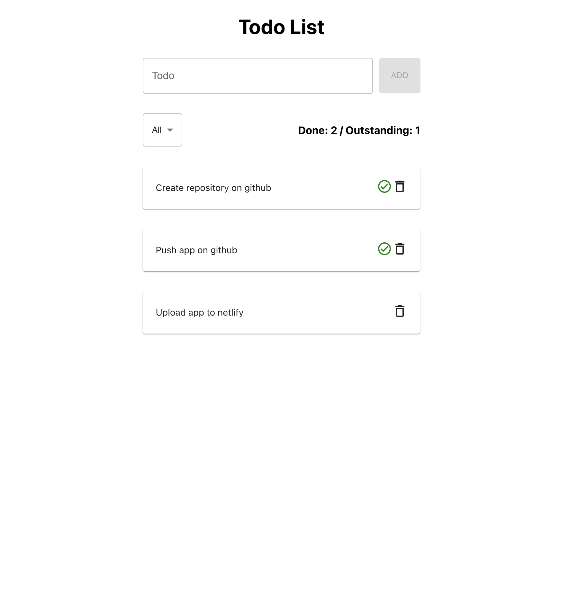

<h1>Todo List</h1>

Find your book : https://celadon-creponne-da2728.netlify.app/

 
Test task info: https://drive.google.com/file/d/17i3HWkCW8OdvmczEcE2p3q-ljU-2sAWz/view
 

<h2>To build container follow next steps</h2>
1. run docker build -t todo-list:dev .
 
 
2. then run docker run -it --rm \
-v ${PWD}:/app \
-v /app/node_modules \
-p 3001:3000 \
-e CHOKIDAR_USEPOLLING=true \
todo-list:dev
 
 
3. app will be started on http://localhost:3001/

